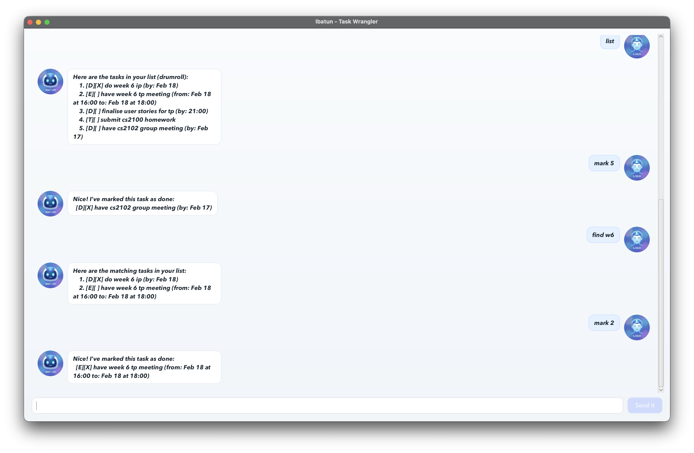

# Ibatun User Guide

Ibatun is a lightweight GUI task tracker that helps you capture todos, deadlines, and events in seconds. Type commands into the input bar and press Enter (or click Send) to manage your list.



## Quick start

1. Launch the app.
2. Type a command into the input bar.
3. Press Enter (or click Send) to execute it.

## Command summary

- `todo <description>`
- `deadline <description> /by <date/time>`
- `event <description> /from <date/time> /to <date/time>`
- `list`
- `mark <task number>`
- `unmark <task number>`
- `delete <task number>`
- `find <keyword> [more keywords...]`
- `bye`

## Adding todos

Creates a task without a date.

Example: `todo Read the IPC handbook`

Expected output:

```
Got it. I've added this todo:
	[T][ ] Read the IPC handbook
I will nag you later.
```

## Adding deadlines

Creates a task with a due date/time.

Example: `deadline Submit report /by 2027-02-14 18:00`

Expected output:

```
Got it. I've added this deadline:
	[D][ ] Submit report (by: Feb 14, 2027 at 18:00)
Time is a flat circle.
```

## Adding events

Creates a task with a start and end date/time.

Example: `event Product demo /from 2027-02-14 13:00 /to 2027-02-14 15:00`

Expected output:

```
Got it. I've added this event:
	[E][ ] Product demo (from: Feb 14, 2027 at 13:00 to: Feb 14, 2027 at 15:00)
Calendar now 1% busier.
```

## Listing tasks

Lists all tasks with their numbers.

Example: `list`

Expected output:

```
Here are the tasks in your list (drumroll):
	1. [T][ ] Read the IPC handbook
	2. [D][ ] Submit report (by: Feb 14, 2027 at 18:00)
```

## Marking tasks as done

Marks the task with the given number as completed.

Example: `mark 1`

Expected output:

```
Nice! I've marked this task as done:
  [T][X] Read the IPC handbook
```

## Unmarking tasks

Marks the task with the given number as not done.

Example: `unmark 1`

Expected output:

```
Okay! I've unmarked this task as done:
  [T][ ] Read the IPC handbook
```

## Deleting tasks

Removes the task with the given number.

Example: `delete 2`

Expected output:

```
Poof. I've removed this task:
	[D][ ] Submit report (by: Feb 14, 2027 at 18:00)
Now you have 1 tasks in the list.
```

## Finding tasks

Searches for tasks that approximately match one or more keywords.

Example: `find report demo`

Expected output:

```
Here are the matching tasks in your list:
	1. [D][ ] Submit report (by: Feb 14, 2027 at 18:00)
	2. [E][ ] Product demo (from: Feb 14, 2027 at 13:00 to: Feb 14, 2027 at 15:00)
```

## Exiting

Closes the app.

Example: `bye`

## Date and time inputs

Ibatun accepts flexible date/time inputs. Common examples:

- ISO dates and times: `2027-02-14`, `2027-02-14T18:00`, `2027-02-14 18:00`
- Month-name formats: `Feb 14 2027`, `Feb 14 2027 18:00`, `14 Feb 2027`
- Numeric day-first: `14/2/2027`, `14-2-2027`
- Month-name without year (uses current year): `Feb 14`, `Feb 14 6pm`
- Time-only (next occurrence): `18:00`, `6pm`
- Weekdays (next occurrence): `mon`, `tuesday`

If you enter only a time and it has already passed today, Ibatun schedules it for the next day.

## Data storage

Your tasks are saved automatically to a JSON file:

- macOS: `~/Library/Application Support/Ibatun/tasks.json`
- Windows: `%APPDATA%\Ibatun\tasks.json`
- Linux: `$XDG_DATA_HOME/Ibatun/tasks.json` or `~/.local/share/Ibatun/tasks.json`
